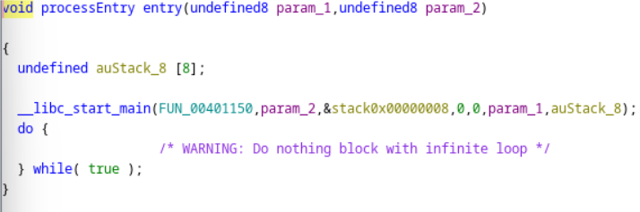
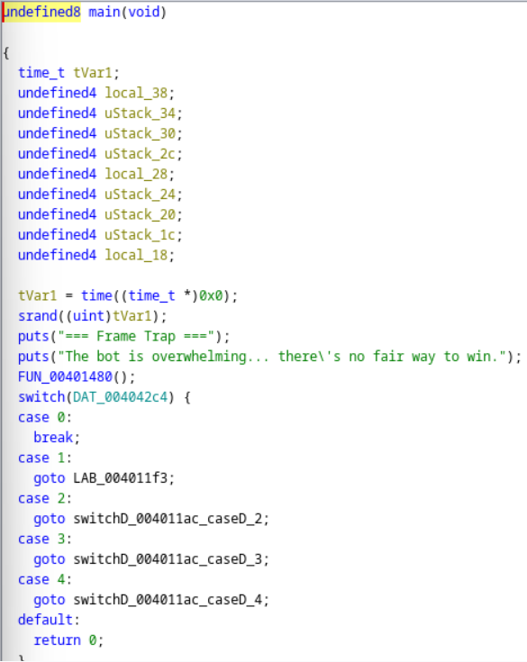
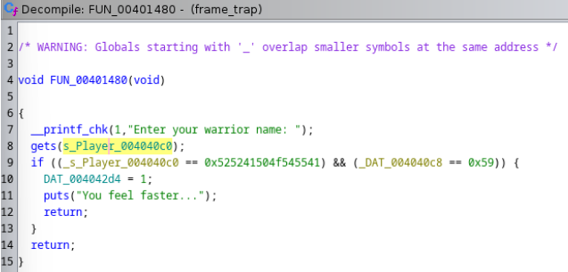
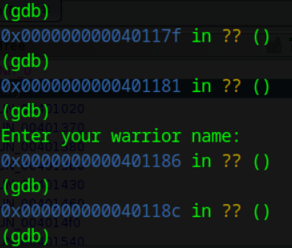
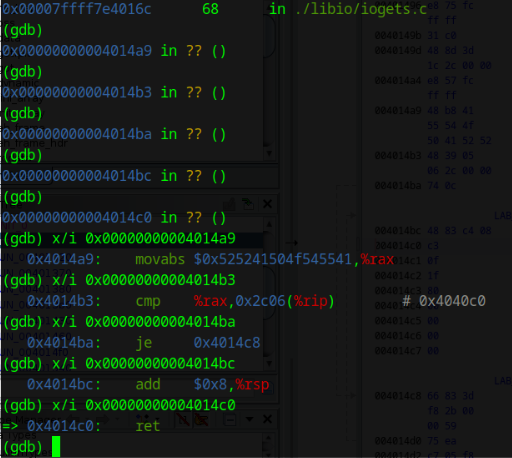
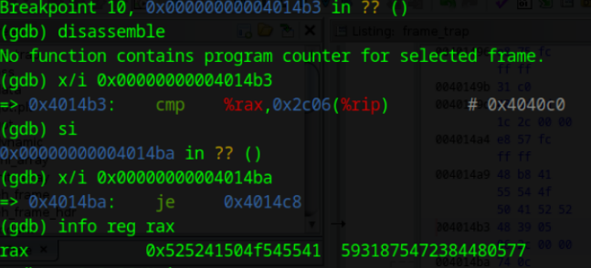
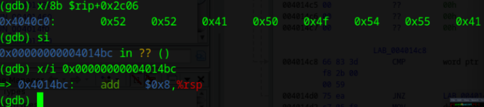
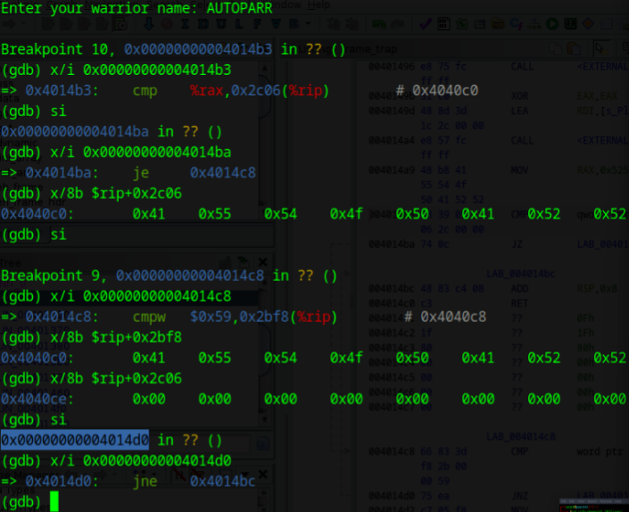
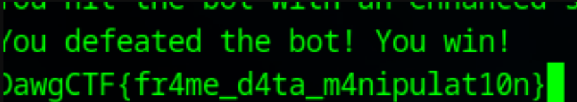

# Dawg_CTF_2025/Pwn/Just_Parry_Lol

### Our Solve
So we are given this [binary](https://github.com/UMBCCyberDawgs/dawgctf-sp25/tree/main/Just%20Parry%20Lol)

Throwing this binary into Ghidra, we can note theres no "main" function, but entry() calls __libc_start_main with FUN_00401150, so lets rename FUN_00401150 to main.

Next thing we note is that main() calls FUN_00401480.

We explore this function and notice gets() is reading from stdin and storing it into a global array of characters. Then looking at the first if statement condition, translating the hex to characters gives us RRAPOTUA. 0x59 should be Y, but whats that global variable its being compared to in the second condition of the if statement?

Next we rename FUN_00401480 to warrior_name_prompt and run the binary in gdb. After stepping through instructions across function calls, we come across the prompt.

The following is the assembly right after the gets() function as you can note at the top of the screenshot

Next we set a breakpoint at 0x4014b3 (breakpoint 10) since it is right before cmp executes and we input the correct string for warrior name (RRAPOTUA). The following is the result of making it to that breakpoint and inspecting the first operand (rax).

Then we inspect the contents at the second operand of the cmp instruction. We become confused since the characters are the same but the jump wasn't taken as shown.

We realize oops we forgot to consider little endian, and RRAPOTUA is actually AUTOPARR. Now we try again and make it to the next cmp instruction. We notice its using the same location of where the warrior name was stored.

Then we hit an OHHHH moment and the right name is AUTOPARRY. This realization was that the global variable being used in that second condition of the if statement is just looking at the last 16 bits (note the "w" in cmpw) of the same warrior name location. So this means we need to input AUTOPARRY. This allows us to get that boost inside of the if statement.

Then another realization hits. From previous runs of the program when just testing it out with different selections and input, we always lost the game. After rereading the challenge name "just parry lol", we're like "Oh maybe we literally just have to parry".

Now we connect to the server, input "AUTOPARRY", and parry twice. We win and get the flag!

Also, shoutout to the For Honor reference.