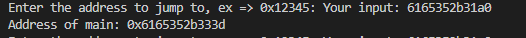
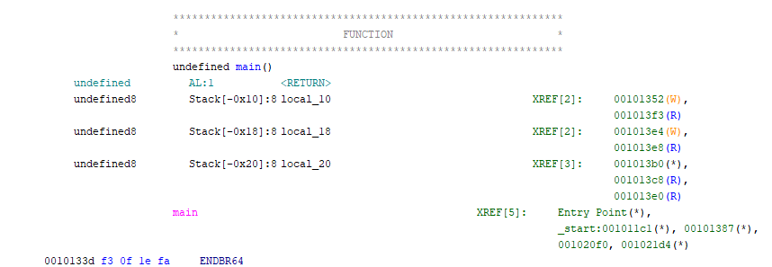

# Pie Time - Easy Challenge
by Hamdi Korreshi

```nc rescued-float.picoctf.net 65058```
This is the recommended way to handle this challenge, however, since I want to use this as a jumping board to harder challenges I am using Ghidra. However, if you do run the file try running %x will print something crazy.  Also note that every single time the file is ran, the last 3 hex or so are always the same. Even in Ghidra you'll see the same thing occur. 

So now, lets talk about the actual challenge, the goal is very simple, put in the memory address that will direct you towards the function. Ghidra on the right will show you that we intake some variable from input then convert it to a pointer, then call that pointer. So the goal is find the memory address for that function win, the way this file was compiled makes it so the last 3 hexes are the same, this won't be the case for harder challenges. SO we use Ghidra to figure out the difference between the two memory addresses. 0010133d is the main and 001012a7 is the win function memory address, subtracting the two give us -0x96. We will add that to whatever memory address that we are using, so run ```nc rescued-float.picoctf.net 65058``` and see what memory address you get.
Mine was 0x596a47e9e33d so + -0x96 gives me 596a47e9e2a7, and that's it we have now gotten the flag!